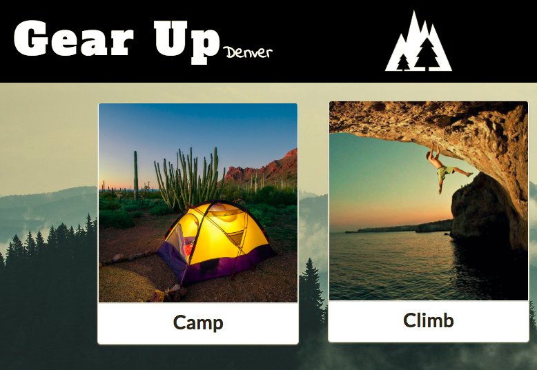

# **Gear Up (Denver)**

Gear up is a peer-to-peer outdoor / recreational gear sharing service. Colorado is
known for it vibrant outdoor community. Whether it's camping, kayaking, snowboarding, or
mountain biking, Colorado has invigorating outdoor activities for every season. Unfortunately,
acquiring the necessary equipment to participate in these activities can often be prohibitively expensive.
We at Gear Up feel that every person has the right to enjoy to great outdoors of this state. Our application
allows users to post their excess or unused gear for daily rental by those who want to try something new,
or presently do not have the means to purchase recreational equipment.

## **Getting Started**

As a prospective lender:
  - Create a profile with your email & credit card information
  - Fill out our add gear form
  - Click on update in order to update or delete a post
  - Your gear will be posted to our site and you should expect requests very soon!

As a user:
  - Create a profile with your email & credit card information
  - Browse by category or search
  - Request to book with a short message to the lender
  - You will be notified within 24 hours of the status of your request, and arrangements will be made
    between you and the lender

### **Our Site**
https://denver-gear-up.firebaseapp.com/

### **Backend**
https://gear-up-backend.herokuapp.com/gear

### **Slides / Demo**
https://slides.com/trescara/galvanize-g/fullscreen#/

### **Built With**
React.js
Express.js
Knex
Postgresql
Semantic UI - react
Cypress
Firebase Authentication

### **Authors**
Allison Livingston, David Gurley, Keith Decker, Matthew Hyrka, Shaun Carter

### **Contact**
Allison Livingston
Email: allisonlivingston16@gmail.com
LinkedIn: www.linkedin.com/in/allisonlivingston16
### **License**
This project is licensed under the MIT License - see the LICENSE.md file for details
